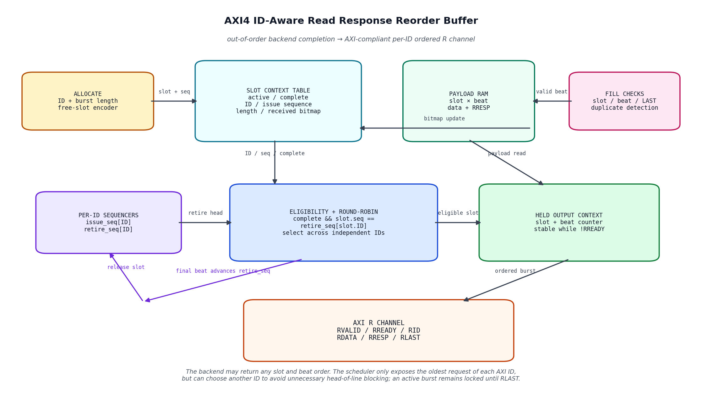
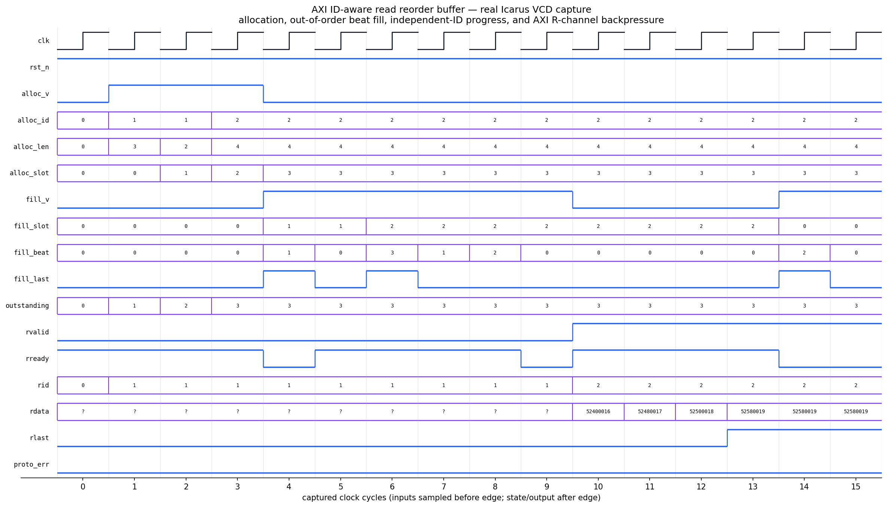

<!-- Author: Asresh Kuricheti -->
# Day 52 — AXI4 ID-Aware Read Response Reorder Buffer

This project implements a multi-outstanding read response reorder buffer for an
AXI4-style master port. Requests are assigned internal slots and per-ID sequence
numbers. A parallel memory backend, NoC, HBM controller, or chiplet fabric may
return the slots and their beats in any order; the buffer stores those beats,
checks their framing, and emits legal AXI R-channel bursts. Requests carrying the
same AXI ID always retire in issue order, while independent IDs may make progress
without global head-of-line blocking.

The module deliberately abstracts the AXI AR address channel and the backend's
physical routing. Its allocation handshake is the point where an upstream AR
request has been accepted and assigned a backend transaction slot. The output is
the AXI read-data subset (`RID`, `RDATA`, `RRESP`, `RLAST`, and ready/valid), making
the central ordering, buffering, arbitration, and flow-control problem explicit.

Recent high-value RTL roles motivated this project. NVIDIA's coherent-interconnect
and custom-SoC openings emphasize AXI/ACE/CHI, cache-coherent fabrics, arbiters,
schedulers, synchronization, and constrained-random verification. Micron's HBM
digital-design roles emphasize parameterized RTL, memory controllers, FIFOs,
pipelines, arbitration, ECC, and performance/power/area tradeoffs. An ID-aware
response reorder buffer sits directly at the intersection of those skills.

## Features

- Parameterized data width, AXI ID width, slot count, maximum burst length, and
  per-ID sequence width.
- Free-slot allocation with an internal tag returned to the backend request path.
- Fully out-of-order fill across transaction slots and within each burst.
- Per-ID issue and retirement sequence tracking, preserving the AXI ordering rule
  without imposing unnecessary ordering between different IDs.
- Round-robin selection among eligible IDs/slots to prevent fixed-priority
  starvation.
- Burst locking: once an AXI response starts, its slot stays selected through
  `RLAST`, even under arbitrary `RREADY` backpressure.
- Per-beat `RRESP` storage alongside payload data.
- Inactive-slot, duplicate-beat, out-of-range-beat, and incorrect-`LAST` detection
  through a one-cycle protocol-error pulse.
- Reset-safe invalidation, occupancy reporting, and elaboration-time parameter
  checks including sequence-space safety.

## Circuit diagram



*Generated architecture diagram of the implemented circuit. It shows slot
allocation, context and payload storage, per-ID sequence tracking, eligible-slot
arbitration, held burst state, and the ordered AXI R channel. It is documentation,
not a simulator screenshot.*

## Parameters

| Parameter | Default | Meaning |
|---|---:|---|
| `DATA_W` | 32 | Width of each response data beat |
| `ID_W` | 3 | Width of the AXI transaction ID |
| `SLOTS` | 8 | Maximum outstanding requests; power of two |
| `MAX_BEATS` | 4 | Maximum beats per request; power of two |
| `SEQ_W` | 4 | Per-ID issue/retirement sequence width |
| `SLOT_W` | derived | Internal slot/tag width |
| `BEAT_W` | derived | Beat-index width |
| `LEN_W` | derived | Encoded burst-length width |
| `COUNT_W` | derived | Outstanding counter width |
| `IDS` | derived | Number of AXI IDs, `2**ID_W` |

`SEQ_W` must represent at least twice `SLOTS`. This keeps wrapped sequence values
unambiguous while no more than `SLOTS` transactions can be live.

## Ports

| Port | Direction | Width | Meaning |
|---|---|---:|---|
| `clk` | in | 1 | Rising-edge clock |
| `rst_n` | in | 1 | Asynchronous active-low reset |
| `alloc_valid_i`, `alloc_ready_o` | in/out | 1 | Request-slot allocation handshake |
| `alloc_id_i` | in | `ID_W` | AXI ID of the accepted read request |
| `alloc_beats_i` | in | `LEN_W` | Burst length from 1 through `MAX_BEATS` |
| `alloc_slot_o` | out | `SLOT_W` | Internal slot/tag assigned on allocation |
| `fill_valid_i`, `fill_ready_o` | in/out | 1 | Backend response-beat handshake |
| `fill_slot_i` | in | `SLOT_W` | Slot/tag returned by the backend |
| `fill_beat_i` | in | `BEAT_W` | Zero-based beat position within the burst |
| `fill_data_i` | in | `DATA_W` | Backend response payload |
| `fill_resp_i` | in | 2 | AXI response status stored with the beat |
| `fill_last_i` | in | 1 | Backend framing indication, checked against length |
| `rvalid_o`, `rready_i` | out/in | 1 | AXI R-channel transfer handshake |
| `rid_o` | out | `ID_W` | ID of the retiring read request |
| `rdata_o` | out | `DATA_W` | Ordered response data |
| `rresp_o` | out | 2 | Ordered per-beat AXI response status |
| `rlast_o` | out | 1 | Final response beat for the selected request |
| `outstanding_o` | out | `COUNT_W` | Allocated requests not yet fully retired |
| `protocol_error_pulse_o` | out | 1 | One-cycle rejected-backend-beat indication |

## ASCII block diagram

```text
 accepted read: ID + length
             |
             v
   +-------------------+       backend slot + beat + data + LAST
   | free-slot encoder |                         |
   +---------+---------+                         v
             | slot + per-ID seq       +--------------------+
       +-----v--------------------------> fill/framing checks |
       |                                +----------+---------+
       |                                           |
 +-----v------------+    +-------------------------v---+
 | slot contexts    |    | payload RAM: slot × beat    |
 | ID/seq/len/map   |    | data + RRESP                |
 +-----+------------+    +-----------------------------+
       | complete, ID, seq                 |
       v                                   |
 +-------------------------+               |
 | per-ID retire heads +   |<--------------+
 | round-robin eligibility |        payload lookup
 +------------+------------+
              v
      +-------+--------+       +--------------------------+
      | held burst slot |------>| AXI R: ID/data/resp/last |
      | + beat counter  |<------| ready/backpressure       |
      +-----------------+       +--------------------------+
```

## How it works

### Allocation and sequence assignment

The allocation path scans for an inactive slot. A successful handshake records
the request's AXI ID, burst length, and the current `issue_seq` value for that ID,
then advances the ID's issue sequence. The returned slot number becomes an
internal transaction tag carried through the backend. Different requests may use
the same AXI ID; their sequence values distinguish their required retirement
order.

### Out-of-order response assembly

The backend can fill any active slot and any not-yet-received beat. A bitmap tracks
which positions are present, while a two-dimensional payload RAM stores data and
`RRESP`. The block rejects a fill for an inactive or already-complete slot, a beat
outside the allocated length, a duplicate beat, or a `fill_last_i` value that does
not match the recorded final position. When the updated bitmap covers the whole
burst, the context becomes complete.

### Per-ID ordering and arbitration

A complete slot is eligible only when its recorded sequence equals
`retire_seq[slot_id]`. Therefore a younger request can finish early but cannot
bypass an older request with the same AXI ID. There is intentionally no global
ordering constraint: a complete request on another ID remains eligible. A rotating
slot scan chooses among all eligible contexts, approximating fair service without
a large cross-ID priority tree.

### AXI burst retirement

The chosen slot is latched into a held output context. Its beats are read in
ascending order and transferred only when `RVALID && RREADY`. All output fields
remain stable during stalls. On `RLAST`, the slot is released, that ID's retirement
sequence advances, occupancy decrements, and the round-robin base moves past the
retired slot.

## Simulation timing



*Waveform rendered from the VCD captured by the real Icarus Verilog simulation.
The selected directed interval shows three allocations, reverse/out-of-order beat
fills, an independent ID retiring while an older same-ID request is incomplete,
and a held AXI response beat during `RREADY` backpressure.*

## Use-case examples

- HBM and multi-channel DRAM controllers that distribute reads across banks and
  channels with unequal latency, then return legal AXI responses.
- Cache-coherent NoC endpoints translating internal routed response packets into
  an AXI master interface while honoring per-ID order.
- GPU and AI accelerators with many outstanding tensor, texture, or DMA reads
  spread across memory partitions.
- CXL, UCIe, and chiplet bridges whose link-layer transactions return out of order
  relative to the host-side AXI port.
- PCIe or NVMe DMA engines that map internal tags to AXI IDs and need burst-safe
  backpressure at the system interconnect.
- FPGA memory fabrics combining several variable-latency slaves behind one AXI
  port without serializing unrelated request streams.

In a larger SoC this block sits between the return side of a parallel memory or
interconnect backend and the AXI R channel. A production integration may add
timeouts, poison/ECC metadata, cancellation on reset-domain events, QoS-weighted
arbitration, RAM macros, and assertions proving sequence-space and liveness rules.

## Running

```bash
make icarus
make verilator
make vcs
make questa
```

Every target compiles the same synthesizable RTL and self-checking testbench. The
Icarus target writes `axi_read_reorder_buffer.vcd` and prints
`RESULT: *** PASS ***` only after the complete scoreboard drains without errors.

## What the testbench checks

The testbench maintains an independent golden queue for every AXI ID and golden
data/response storage for every allocated slot. Directed traffic completes a
younger request before an older request with the same ID, completes a different ID
independently, fills bursts in reverse beat order, and injects inactive-slot and
incorrect-`LAST` traffic. Ten randomized batches vary ID reuse, request length,
completion order, forward/reverse beat order, `RRESP`, and `RREADY` stalls.

On every R-channel handshake the scoreboard checks ID, data, response status,
beat position, final-beat framing, and per-ID request order. It also verifies
output stability while stalled, exact protocol-error pulses, final occupancy, and
complete draining of every per-ID queue. A global timeout detects deadlock. The
captured run completed 60 requests and 866 checks.

## Career relevance

- [NVIDIA Senior Logic Design Engineer — Cache Coherent Interconnects](https://nvidia.wd5.myworkdayjobs.com/en-US/NVIDIAExternalCareerSite/job/Senior-Logic-Design-Engineer--Cache-Coherent-Interconnects_JR2014881)
- [NVIDIA Custom SoC/IP Verification Engineer](https://nvidia.wd5.myworkdayjobs.com/en-US/NVIDIAExternalCareerSite/job/Custom-SOC-IP-Verification-Engineer_JR2013284)
- [Micron MTS Digital Design Engineer, HBM](https://careers.micron.com/careers/job/40623857)

## Author

Asresh Kuricheti
