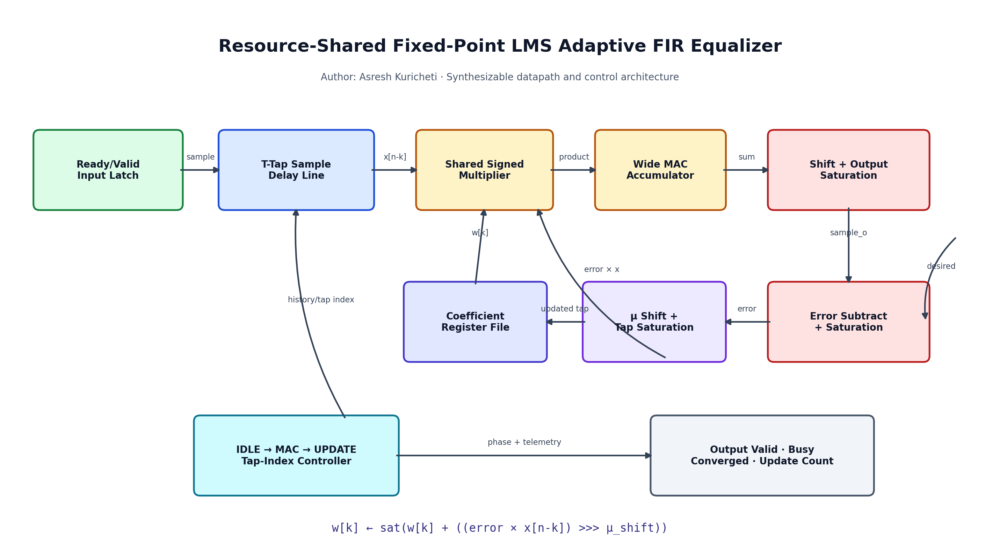
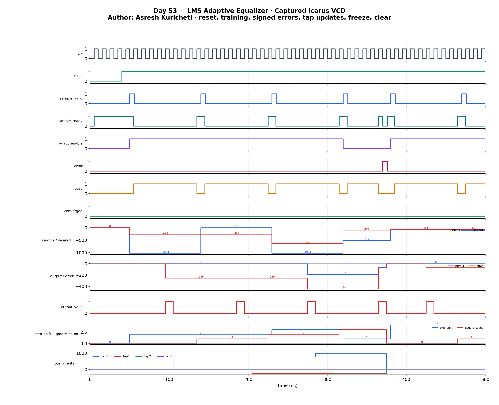

<!-- Author: Asresh Kuricheti -->
# Day 53 — Fixed-Point LMS Adaptive FIR Equalizer

This project implements a signed, fixed-point least-mean-squares (LMS) adaptive
FIR equalizer. For every accepted training pair it filters the input through a
programmable tap vector, compares the result with the desired symbol, and nudges
each coefficient down the instantaneous squared-error gradient. The datapath
reuses one multiplier across the MAC and update phases, demonstrating a practical
area-versus-throughput tradeoff rather than hiding the algorithm in one large
combinational expression.

The project is motivated by current high-value RTL work in mixed-signal SoCs and
high-speed links. Apple RTL roles call out DSP algorithm translation, pipelining,
resource sharing, SystemVerilog verification, SerDes, and PPA optimization. An
adaptive equalizer exercises those skills in a standalone synthesizable block.

## Features

- Parameterized sample width, coefficient width, fixed-point formats, and tap count.
- Signed two's-complement FIR datapath with a widened accumulator.
- LMS update `w[k] += μ × error × x[n-k]`; a power-of-two step makes scaling an
  arithmetic shift rather than a divider.
- One shared multiplier and iterative MAC/update phases for low area.
- Saturation on output, error, and every coefficient update; no silent wraparound.
- Runtime adaptation freeze for inference after training.
- Synchronous clear of delay line, learned coefficients, FSM, and update counter.
- Ready/valid input, valid-aligned output/error, busy and convergence flags,
  update telemetry, and a flattened coefficient view.
- Elaboration-time guards for invalid parameter combinations.

## Circuit diagram



*Generated architecture diagram of the implemented circuit. It shows the input
delay line, shared multiplier, accumulator, saturating error path, coefficient
RAM, LMS update loop, and controller. It is documentation, not a simulator capture.*

## Parameters

| Parameter | Default | Meaning |
|---|---:|---|
| `DATA_W` | 12 | Signed sample and error width |
| `COEFF_W` | 16 | Signed coefficient width |
| `TAPS` | 4 | Number of FIR delay-line taps |
| `SAMPLE_FRAC` | 10 | Fractional bits in input, desired, output, and error |
| `COEFF_FRAC` | 12 | Fractional bits in each coefficient |
| `STEP_SHIFT_W` | 4 | Width of the runtime power-of-two step selector |
| `ERROR_THRESHOLD` | 24 | Absolute-error limit for `converged_o` |
| `TAP_W` | derived | Tap-index width |
| `ACC_W` | derived | Widened FIR accumulation width |
| `UPDATE_W` | derived | Widened coefficient-update arithmetic width |

With the defaults, samples use a signed Q1.10-like scale and coefficients use
Q3.12. The effective stored-integer update shift is
`2*SAMPLE_FRAC - COEFF_FRAC + step_shift_i`.

## Ports

| Port | Direction | Width | Meaning |
|---|---|---:|---|
| `clk`, `rst_n` | in | 1 | Clock and asynchronous active-low reset |
| `clear_i` | in | 1 | Synchronously erase history, taps, outputs, and counters |
| `sample_valid_i`, `sample_ready_o` | in/out | 1 | Input acceptance handshake |
| `adapt_enable_i` | in | 1 | Update taps after this sample's error |
| `sample_i` | in | `DATA_W` | Signed equalizer input sample |
| `desired_i` | in | `DATA_W` | Signed training-reference sample |
| `step_shift_i` | in | `STEP_SHIFT_W` | Extra right shift controlling LMS step size |
| `output_valid_o` | out | 1 | Pulse when output/error are valid |
| `sample_o` | out | `DATA_W` | Saturated FIR output |
| `error_o` | out | `DATA_W` | Saturated `desired_i - sample_o` |
| `converged_o` | out | 1 | Valid-aligned absolute-error threshold result |
| `busy_o` | out | 1 | MAC or coefficient-update phase is active |
| `update_count_o` | out | 32 | Completed adaptive samples since reset/clear |
| `coeffs_o` | out | `TAPS*COEFF_W` | Live taps; tap zero occupies the LSB slice |

## ASCII block diagram

```text
 sample + desired + adapt + μ-shift
              |
              v
    +--------------------+       tap index       +----------------+
    | handshake / FSM    |---------------------->| coefficient RAM|
    | IDLE → MAC → UPDATE|                       +-------+--------+
    +---------+----------+                               |
              |                                          v
       +------v-------+   x[n-k]   +----------------+  w[k]
       | sample delay |----------->| shared signed  |<----+
       | line, T taps |            | multiplier     |
       +--------------+            +-------+--------+
                                           |
                         +-----------------+------------------+
                         |                                    |
                         v MAC phase                          v UPDATE phase
                  +-------------+                     +---------------+
                  | accumulator |                     | scale by μ +  |
                  +------+------+                     | saturate tap  |
                         |                            +-------+-------+
                  shift + saturate                            |
                         v                                    +----> coefficient RAM
                    sample_o
                         |
 desired_q -------------(-)----> error_o / convergence / update error
```

## How it works

### Sample capture and delay line

`sample_ready_o` is high only in `IDLE`. A valid handshake shifts older samples
toward the last tap, inserts `sample_i` at tap zero, and snapshots the desired
value, adaptation enable, and step shift. Inputs can then change safely.

### Resource-shared FIR MAC

During `MAC`, one tap product is accumulated per clock. After the final tap, the
widened sum is arithmetically shifted by `COEFF_FRAC`, saturated into `DATA_W`,
and emitted as `sample_o`. The separately saturated training error is
`desired_q - sample_o`. This maps naturally onto one DSP multiplier and an
accumulator register.

### LMS update loop

When adaptation is enabled, `UPDATE` revisits the captured history one tap per
clock:

```text
delta[k] = (error × history[k]) >>>
           (2*SAMPLE_FRAC - COEFF_FRAC + step_shift)
coefficient[k] = saturate(coefficient[k] + delta[k])
```

Positive error/input correlation raises a tap; negative correlation lowers it.
Smaller step shifts learn faster but carry more misadjustment risk. With
adaptation disabled, the update phase is skipped and coefficients cannot drift.

### Latency and throughput

An adaptive transaction takes one acceptance edge, `TAPS` MAC clocks, and `TAPS`
update clocks. Output/error become valid after the MAC, while `busy_o` remains
high until every tap write finishes. Frozen-coefficient inference skips `UPDATE`.
The deterministic schedule trades sample rate for substantial multiplier-area
reduction and is straightforward to constrain.

## Simulation timing



*Waveform rendered from the VCD captured by the real Icarus Verilog simulation.
The directed interval covers reset release, positive and negative training
errors, iterative coefficient updates, an adaptation-frozen sample, and the
synchronous clear that returns all taps to zero.*

## Use-case examples

- **SerDes receiver equalization:** train tap weights against a known sequence to
  reduce pre/post-cursor inter-symbol interference before symbol decisions.
- **Wireline and optical DSP:** adapt to temperature, package, cable, and channel
  changes in PCIe, Ethernet, USB, DisplayPort, or chiplet PHY receive paths.
- **Echo and interference cancellation:** learn a coupled transmit-to-receive
  path in full-duplex links or acoustic front ends.
- **Adaptive noise cancellation:** learn correlated noise from a reference
  sensor while preserving a microphone, biomedical, or instrumentation signal.
- **Channel identification:** estimate an unknown impulse response during lab
  bring-up, production test, or link-health telemetry.
- **FPGA software-defined radio:** reuse one DSP slice across several taps when
  the sample rate is below the fabric clock.

In a larger receiver this block belongs after ADC/clock recovery and before the
symbol slicer, descrambler, and FEC decoder. Production variants often add
normalized LMS, decision-directed modes, coefficient presets, parallel samples
per clock, shadow-bank updates, and formal overflow properties.

## Running

```bash
make icarus
make verilator
make vcs
make questa
```

Every target compiles the same synthesizable RTL and self-checking testbench.
Icarus writes `lms_adaptive_equalizer.vcd` and prints
`RESULT: *** PASS ***` only when the independent model agrees.

## What the testbench checks

The testbench independently models the sample history, FIR dot product,
output/error saturation, LMS scaling, coefficient saturation, and update count.
Directed samples force positive and negative updates, exercise adaptation freeze,
and verify synchronous clear. Then 120 pseudo-random training samples identify a
known four-tap response, followed by 24 randomized inference samples proving that
frozen taps do not move.

For every transaction it checks the filtered sample, error, convergence flag,
busy lifetime, every coefficient, and update count. Reset/clear handshakes and
the exact accepted-sample total are also checked. A global timeout detects
deadlock. The captured Icarus run accepted 148 samples, applied 120 LMS updates,
completed 1,348 checks, and printed `RESULT: *** PASS ***`.

## Career relevance

- [Apple RTL Design Engineer — DSP and mixed-signal pipelines](https://jobs.apple.com/en-us/details/200657270-0505/rtl-design-engineer)
- [Apple SerDes Circuit Design Engineer — adaptive equalization and 100+ Gbps links](https://jobs.apple.com/en-us/details/200662975/serdes-circuit-design-engineer)
- [NVIDIA ASIC Hardware Design Engineer — system RTL and design-quality flows](https://nvidia.wd5.myworkdayjobs.com/en-US/NVIDIAExternalCareerSite/job/ASIC-Hardware-Design-Engineer---New-College-Grad-2026_JR2011787)

## Author

Asresh Kuricheti
