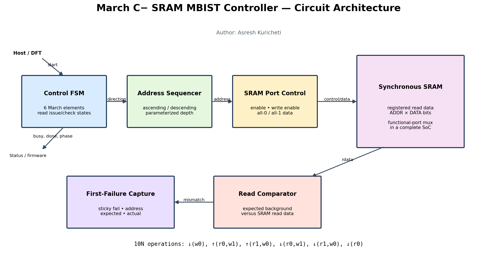
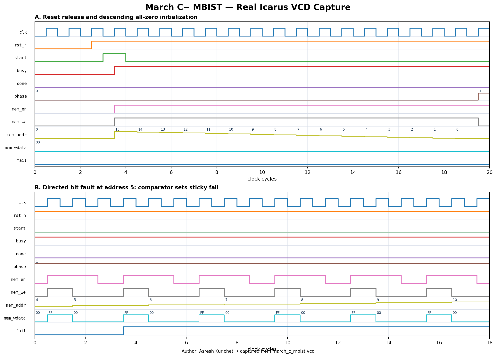

<!-- Author: Asresh Kuricheti -->
# Day 54: March C− SRAM MBIST Controller

## Overview

This project implements a synthesizable memory built-in self-test controller for a synchronous single-port SRAM. It executes the industry-standard March C− sequence, continues after errors, and preserves the first failing address, expected word, and observed word for post-silicon diagnosis. The controller is parameterized for SRAM width and depth and leaves the array in the all-zero background.

This project is motivated by current HBM and SoC RTL roles that call for memory/logic BIST, robust reset behavior, parameterized SystemVerilog, verification, and DFT-aware integration.

## Features

- Complete 10N-operation March C− algorithm with ascending and descending address sweeps
- One-cycle synchronous SRAM-read support with explicit issue/check states
- Sticky first-failure capture while the test continues to completion
- Reset-safe `start`/`busy`/one-cycle `done` control interface
- Live phase telemetry for bring-up and waveform debug
- Clean final zero background, useful before handing SRAM ownership to functional logic

## Parameters

| Parameter | Default | Description |
|---|---:|---|
| `ADDR_WIDTH` | 6 | SRAM address width |
| `DATA_WIDTH` | 32 | SRAM word width |
| `DEPTH` | `2**ADDR_WIDTH` | Number of tested words |

## Ports

| Port | Direction | Description |
|---|---|---|
| `clk`, `rst_n` | input | Clock and asynchronous active-low reset |
| `start_i` | input | Starts a test when idle |
| `busy_o`, `done_o` | output | In-progress flag and one-cycle completion pulse |
| `fail_o` | output | Sticky failure result for the current run |
| `fail_addr_o` | output | Address of the first mismatch |
| `fail_expected_o`, `fail_actual_o` | output | First-failure diagnostic words |
| `phase_o` | output | Current March element, 0 through 5 |
| `mem_en_o`, `mem_we_o` | output | SRAM enable and write enable |
| `mem_addr_o` | output | SRAM address |
| `mem_wdata_o` | output | SRAM write data |
| `mem_rdata_i` | input | Registered one-cycle SRAM read data |

## Circuit architecture

```text
 start ──> Control FSM ──> address up/down sequencer ──> SRAM addr
              │                         │
              ├── phase / enable / write ────────────> SRAM control
              ├── background generator (all-0/all-1) ─> SRAM wdata
 SRAM rdata ─> comparator ─> sticky first-failure capture ─> diagnostics
              └──────────────────────────────────────> busy / done
```



The diagram separates sequencing, memory-port control, compare, and diagnostic responsibilities so the block can be inserted beside an SRAM ownership mux in a production SoC.

## How it works

The controller applies `{↓(w0), ↑(r0,w1), ↑(r1,w0), ↓(r0,w1), ↓(r1,w0), ↓(r0)}`. Each read is issued in one cycle and checked in the next, matching a registered-output SRAM. Every read/write pair remains at the same address before the sequencer advances. A mismatch sets `fail_o` and captures diagnostic data only if no earlier mismatch was recorded; later errors cannot overwrite the root-cause evidence.

## Simulation timing



The waveform is rendered from the VCD captured by a real Icarus Verilog run. It shows reset release, the initial descending zero-write sweep, transition into the ascending read-zero/write-one element, phase/address movement, and memory control/data values.

## Use cases

- Power-on self-test for SRAMs in HBM controllers, CPU/GPU caches, network switches, and AI accelerators
- Manufacturing test and scan/DFT flows that need deterministic at-speed memory screening
- Periodic safety diagnostics in automotive and industrial controllers
- Firmware-triggered memory health checks with actionable first-failure telemetry
- Pre-initialization of scratchpads, descriptor RAMs, and packet buffers before functional ownership

## Running

```bash
make icarus
make verilator
make vcs
make questa
```

## What the testbench checks

The self-checking testbench contains an independent 10N-operation transaction model. It validates every address, direction, read/write operation, and background value; runs a clean-memory directed test; injects a directed read fault; performs eight randomized fault-address/bit tests; verifies first-failure diagnostics; confirms the final all-zero background; enforces per-run and global timeouts; and dumps `march_c_mbist.vcd`. Success prints `RESULT: *** PASS ***`.
