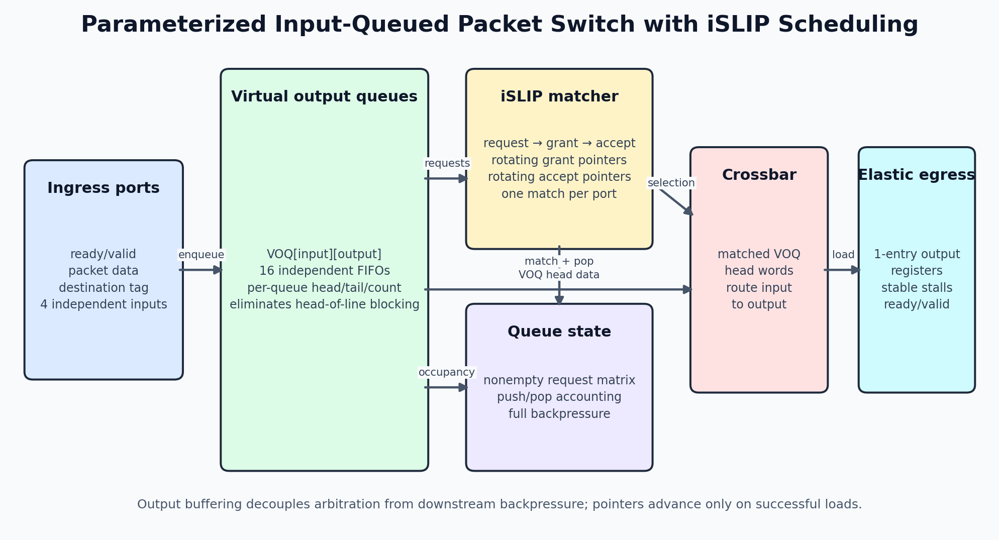
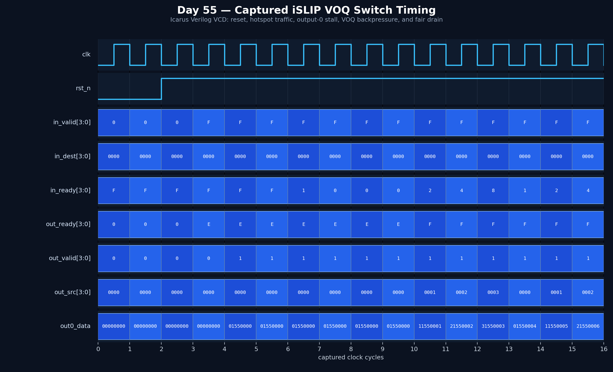

<!-- Author: Asresh Kuricheti -->
# Day 55: Input-Queued Packet Switch with iSLIP Scheduling

## Overview

This project implements a synthesizable, parameterized packet-switch datapath with a virtual output queue (VOQ) for every input/output pair, round-robin iSLIP request/grant/accept matching, and a one-entry elastic register at every egress. Unlike a single FIFO per ingress, VOQs prevent a packet blocked at one destination from stopping traffic to unrelated destinations. The scheduler can connect multiple nonconflicting input/output pairs in the same cycle while preserving FIFO order within each VOQ.

The architecture is motivated by current high-compensation switch-silicon and coherent-interconnect RTL roles that emphasize high-bandwidth datapaths, crossbars, arbitration, scheduling, flow control, performance analysis, and timing-clean SystemVerilog.

## Features

- `PORTS × PORTS` virtual output queues eliminate classical head-of-line blocking
- Parallel request/grant/accept matcher creates a one-to-one switch matching each cycle
- Independent rotating grant and accept pointers provide contention fairness
- One-entry elastic output buffers keep `valid` and data stable during downstream stalls
- Per-destination ingress backpressure prevents queue overflow
- Simultaneous enqueue/dequeue accounting sustains useful throughput under load
- Parameterized port count, data width, and VOQ depth with wrap-safe pointers
- Asynchronous active-low reset clears all queue metadata, scheduler state, and output validity

## Parameters

| Parameter | Default | Description |
|---|---:|---|
| `PORTS` | 4 | Number of ingress and egress ports |
| `DATA_WIDTH` | 32 | Packet/flit data width in bits |
| `VOQ_DEPTH` | 4 | Storage entries in every input/output queue |
| `PORT_W` | `$clog2(PORTS)` | Encoded source/destination width, with a one-bit minimum |
| `PTR_W` | `$clog2(VOQ_DEPTH)` | Circular queue pointer width, with a one-bit minimum |
| `COUNT_W` | `$clog2(VOQ_DEPTH+1)` | Queue occupancy width |

## Ports

| Port | Direction | Description |
|---|---|---|
| `clk` | input | Switch clock |
| `rst_n` | input | Asynchronous active-low reset |
| `in_valid_i[PORTS]` | input | One valid indication per ingress |
| `in_ready_o[PORTS]` | output | Destination-specific admission readiness per ingress |
| `in_data_i[PORTS][DATA_WIDTH]` | input | Packed ingress flit data |
| `in_dest_i[PORTS][PORT_W]` | input | Packed requested egress number |
| `out_valid_o[PORTS]` | output | One valid indication per elastic egress |
| `out_ready_i[PORTS]` | input | Downstream readiness/backpressure |
| `out_data_o[PORTS][DATA_WIDTH]` | output | Packed egress flit data |
| `out_src_o[PORTS][PORT_W]` | output | Source ingress associated with each egress flit |

## Circuit architecture

```text
  ingress ready/valid + destination
                 │
                 ▼
       ┌─────────────────────┐  nonempty requests  ┌──────────────────┐
       │ VOQ[input][output]  ├────────────────────►│ iSLIP matcher    │
       │ head/tail/count RAM │                     │ grant + accept   │
       └──────────┬──────────┘◄──── match/pop ─────└────────┬─────────┘
                  │ selected queue head                      │ selection
                  └──────────────────┬───────────────────────┘
                                     ▼
                              ┌─────────────┐
                              │ N×N crossbar│
                              └──────┬──────┘
                                     ▼
                       elastic egress ready/valid registers
```



The circuit image shows the complete datapath and control loop: admission fills a destination-specific VOQ, occupancy forms the request matrix, iSLIP chooses a conflict-free matching, and the crossbar loads stable egress registers.

## How it works

Each accepted ingress flit is written into the VOQ selected by its destination field. An available output examines all nonempty VOQs targeting it and grants the first requester at or after its rotating grant pointer. Each input may receive grants from several outputs, so the accept phase keeps only the nearest output relative to that input's accept pointer. The resulting one-to-one matching identifies which VOQ heads cross the fabric.

A match loads an output register and pops exactly one queue element. The register may be reloaded in the same cycle that its old value is consumed, but it cannot be overwritten while stalled; this preserves ready/valid stability. Grant and accept pointers advance only when a match successfully loads an output, so backpressure does not distort fairness. Enqueue and dequeue events update each queue count together, including simultaneous activity on the same VOQ.

## Simulation timing



This waveform is rendered from a VCD captured by a real Icarus Verilog simulation. It covers asserted and released reset, four-input hotspot traffic aimed at output 0, an output-0 stall, all four VOQs becoming full, per-input backpressure, and the rotating `0→1→2→3` source order as the switch drains fairly.

## Use cases

- GPU/AI-accelerator on-chip networks carrying independent request and response traffic
- Ethernet switch ASIC ingress fabrics and top-of-rack packet schedulers
- PCIe, CXL, AXI, or CHI interconnect crossbars between protocol endpoints
- Multi-channel DMA engines routing descriptors and payloads to shared resources
- Memory-controller request fabrics connecting clients to banks or channels
- FPGA packet-processing pipelines that need deterministic backpressure and contention fairness

In the larger system, this block sits between packet classification/routing and per-link protocol logic. A real product can add multiple iSLIP iterations, multicast masks, QoS classes, age overrides, credit return, and physical SRAM macros without changing the basic VOQ/matcher boundary.

## Running

```bash
make icarus
make verilator
make vcs
make questa
```

## What the testbench checks

The self-checking testbench maintains an independent cycle-accurate model of all 16 VOQs, grant and accept pointers, crossbar matching, output registers, and ready/valid behavior. Directed traffic fills four queues behind a stalled hotspot output to check overflow backpressure and fair drain. Seven hundred randomized cycles vary every ingress valid, destination, data word, and egress ready signal. The test checks reset state, output validity, payload, source, input readiness, legal queue occupancy, complete drain, minimum throughput, and a global timeout. The passing Icarus run scheduled 1,692 transfers and performed 10,855 comparisons before printing `RESULT: *** PASS ***`.
