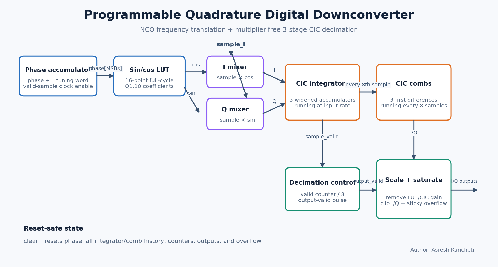
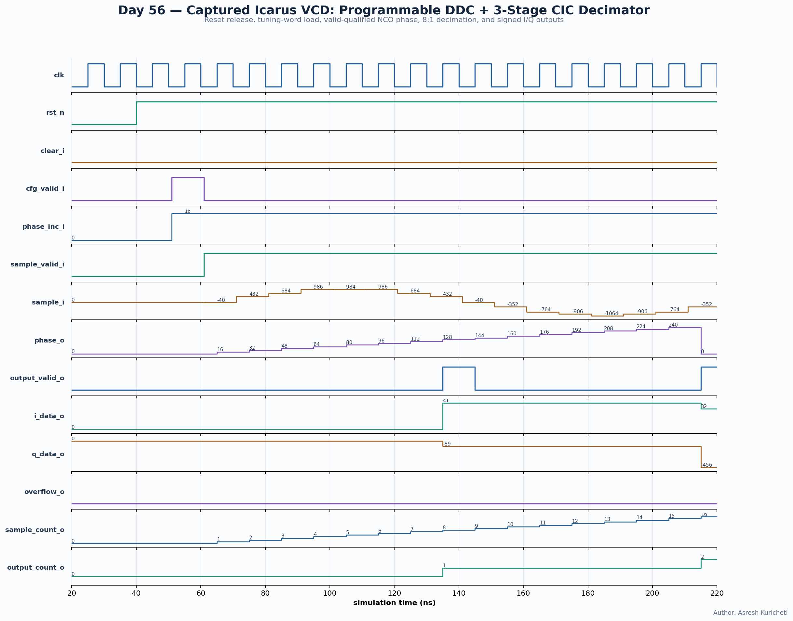

<!-- Author: Asresh Kuricheti -->
# Day 56 — Programmable Quadrature DDC with CIC Decimation

This project implements a complete narrowband digital downconverter (DDC): a
programmable numerically controlled oscillator (NCO), signed I/Q mixers, and a
three-stage cascaded-integrator-comb (CIC) decimator. It translates a selected
channel from a real sampled intermediate frequency to complex baseband while
reducing the sample rate by eight, without multipliers in the decimation filter.

The design is motivated by current Apple RTL roles asking engineers to translate
DSP algorithms into power-efficient fixed-point pipelines, define microarchitecture,
verify bit-true behavior, and integrate digital blocks beside mixed-signal IP.

## Features

- Runtime-programmable phase increment for frequency retuning without reset.
- 8-bit phase accumulator and 16-entry signed sine/cosine lookup table.
- Full-width signed I/Q multiplication with explicit fixed-point scaling.
- Parameterized CIC stage count and power-of-two decimation rate.
- Widened integrators and combs sized for CIC gain, avoiding internal truncation.
- Clock-enable behavior: phase and filters advance only on valid input samples.
- Saturated I/Q outputs and sticky overflow telemetry instead of silent wrapping.
- Synchronous pipeline clear plus asynchronous active-low reset.
- Accepted-sample and produced-output counters for bring-up observability.
- Elaboration-time guards reject unsupported or unsafe parameter combinations.

## Circuit diagram



*Generated architecture diagram of the implemented datapath. It is documentation,
not a simulator capture.*

## Parameters

| Parameter | Default | Meaning |
|---|---:|---|
| `DATA_W` | 12 | Signed real-input sample width |
| `COEFF_W` | 12 | NCO lookup coefficient width |
| `PHASE_W` | 8 | Phase-accumulator width |
| `CIC_STAGES` | 3 | Number of integrator and comb sections |
| `DECIM_RATE` | 8 | Input-to-output sample-rate ratio; power of two |
| `OUT_W` | 16 | Signed width of each baseband output |
| `COEFF_FRAC` | 10 | Fractional bits in the Q1.10 NCO coefficients |
| `RATE_SHIFT` | derived | `log2(DECIM_RATE)` |
| `ACC_W` | derived | Guarded CIC accumulator width |

## Ports

| Port | Direction | Width | Meaning |
|---|---|---:|---|
| `clk`, `rst_n` | in | 1 | Clock and asynchronous active-low reset |
| `clear_i` | in | 1 | Synchronously clear phase, filters, outputs, and counters |
| `cfg_valid_i` | in | 1 | Load `phase_inc_i`; allowed while samples are idle or active |
| `phase_inc_i` | in | `PHASE_W` | NCO tuning word |
| `sample_valid_i` | in | 1 | Qualifies `sample_i` and advances the DDC |
| `sample_i` | in | `DATA_W` | Signed real input sample |
| `output_valid_o` | out | 1 | One-cycle pulse for each decimated I/Q pair |
| `i_data_o`, `q_data_o` | out | `OUT_W` | Saturated complex-baseband output |
| `overflow_o` | out | 1 | Sticky output-saturation indication |
| `phase_o` | out | `PHASE_W` | Live NCO phase for debug |
| `sample_count_o` | out | 32 | Accepted samples since reset/clear |
| `output_count_o` | out | 32 | Produced I/Q pairs since reset/clear |

## ASCII block diagram

```text
 phase_inc_i                         DECIM_RATE = R
      |                                      |
      v                                      v
 +-----------+   address   +----------+  +-------------------+
 | phase     |------------>| sin/cos  |  | sample-enable /   |
 | accumulator|            | LUT      |  | decimation counter|
 +-----------+             +----+-----+  +---------+---------+
                                |                  |
 sample_i ------------------+----+----+             |
                             |         |             |
                         +---v---+ +---v---+         |
                         | × cos | | −×sin |         |
                         +---+---+ +---+---+         |
                             | I       | Q           |
                  +----------v---------v-------------v--+
                  | N cascaded integrators @ input rate |
                  +--------------------+----------------+
                                       | every R samples
                  +--------------------v----------------+
                  | N cascaded combs @ output rate      |
                  +--------------------+----------------+
                                       |
                          gain shift + saturation
                              +--------+--------+
                              v                 v
                          i_data_o          q_data_o
```

## How it works

### Frequency translation

Each accepted input advances the phase accumulator by `phase_inc_i`. The upper
four phase bits address a full-cycle Q1.10 lookup table. Multiplying the real
sample by cosine and negative sine produces complex I/Q samples. The tuning
relationship is `f_LO = phase_inc / 2^PHASE_W × f_sample`; changing the tuning
word moves another channel to DC.

### CIC decimation

Each I/Q mixer output passes through `CIC_STAGES` running integrators. Every
`DECIM_RATE` accepted samples, the final integral enters the same number of
first-difference comb sections. This gives a low-pass response with nulls at
multiples of the new sample rate and uses only adders, subtractors, and registers.
For a constant baseband input the DC gain is `DECIM_RATE^CIC_STAGES`.

The implementation removes the LUT fractional scale and nominal CIC gain with
one arithmetic right shift:

```text
SCALE_SHIFT = COEFF_FRAC + CIC_STAGES × log2(DECIM_RATE)
```

Widened internal arithmetic preserves information until this output boundary.

### Control and corner cases

Invalid cycles freeze phase, decimation count, and all filter state. A retune
updates the tuning word without corrupting accumulated samples. `clear_i` has
priority over samples and resets the entire signal path; it may simultaneously
load a new tuning word. Output saturation is sticky-reported until reset/clear.

## Simulation timing



*Waveform rendered from the VCD captured by the real Icarus Verilog simulation.
It shows reset release, NCO configuration, valid-gapped input, phase progression,
8:1 output-valid decimation, and signed I/Q results.*

## Use-case examples

- **Software-defined radio:** select one narrowband channel from a wide ADC stream
  before lower-rate FIR filtering, demodulation, and packet processing.
- **Wireless baseband SoCs:** translate an IF carrier to I/Q for LTE, Wi-Fi,
  satellite, GNSS, private-radio, or telemetry receivers.
- **Radar and lidar:** downconvert returned chirps or tones before range/Doppler
  FFT processing while reducing downstream bandwidth.
- **Cable, optical, and SerDes instrumentation:** isolate spurs, pilot tones, or
  diagnostic sidebands in lab and on-chip monitor paths.
- **FPGA spectrum analyzers:** instantiate several differently tuned DDCs as a
  channel bank feeding low-rate FFTs or power estimators.
- **Sensor interfaces:** extract a modulated capacitive, inductive, biomedical,
  or lock-in-amplifier signal from broadband converter data.

In a production receiver this block usually sits after the ADC/DC-offset stage
and before a compensation FIR, AGC, demodulator, FFT, or DMA. Larger systems may
add interpolation between LUT entries, a CORDIC NCO, programmable CIC rate,
droop compensation, multi-channel time sharing, and AXI-Stream buffering.

## Running

```bash
make icarus
make verilator
make vcs
make questa
```

Icarus writes `ddc_cic_decimator.vcd`. Every simulator target runs the same
self-checking testbench, which prints `RESULT: *** PASS ***` only when all checks
match the independent cycle-accurate reference model.

## What the testbench checks

The testbench independently models the NCO lookup, two signed mixers, every CIC
integrator/comb state, decimation timing, fixed-point scaling, saturation, sticky
overflow, and telemetry counters. Directed stimulus uses a coherent LUT-based
tone, inserts valid gaps, and retunes the NCO. Randomized signed input and valid
patterns then stress positive/negative arithmetic and nonuniform arrival times.
A combined clear-and-retune case proves reset-safe recovery, while a global
timeout catches deadlock. The testbench narrows `OUT_W` to 10 so ordinary input
levels deliberately exercise positive/negative saturation and sticky overflow.
The captured Icarus run completed 3,228 comparisons and printed
`RESULT: *** PASS ***`.

## Career relevance

- [Apple Wireless RTL Design Engineer — signal-processing-intensive wireless SoCs](https://jobs.apple.com/en-us/details/200658410-3401/wireless-rtl-design-engineer)
- [Apple RTL Design Engineer — fixed-point DSP pipelines and mixed-signal integration](https://jobs.apple.com/en-us/details/200657270/rtl-design-engineer)
- [Apple PHY RTL Design Engineer — low-power PHY microarchitecture](https://jobs.apple.com/en-us/details/200664224-3956/phy-rtl-design-engineer)

## Author

Asresh Kuricheti
