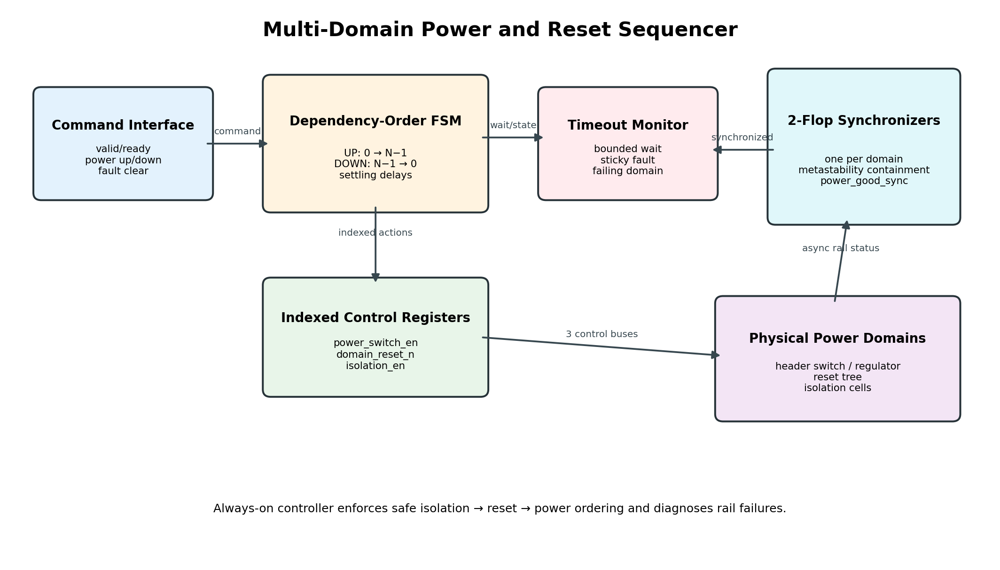
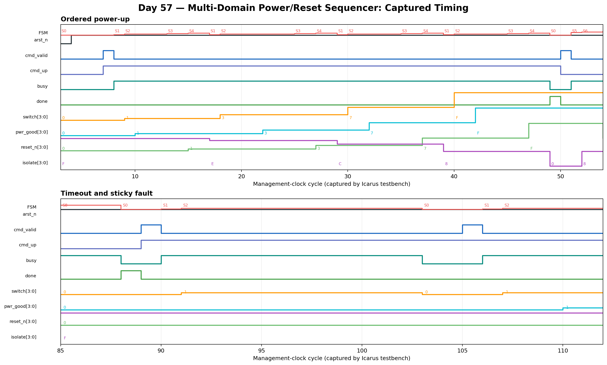

<!-- Author: Asresh Kuricheti -->
# Day 57: Multi-Domain Power and Reset Sequencer

## Overview

Modern SoCs save energy by turning unused blocks off independently. Doing that safely takes more than one enable bit: isolation must prevent an unpowered block from corrupting live logic, reset must be ordered correctly, and the controller must detect a rail that never reaches its expected state. This project implements that always-on control-plane block for a configurable chain of power domains.

The controller powers domains up from 0 to N-1 and powers them down in reverse dependency order. Every asynchronous `power_good` input passes through a two-flop synchronizer. Bounded wait timers make failures observable instead of allowing the sequencer to hang forever.

## Features

- Parameterized number of ordered power domains.
- Safe forward power-up and reverse power-down dependency traversal.
- Two-flop synchronization for asynchronous rail-status inputs.
- Ordered switch, reset, and isolation control with configurable settling delays.
- Per-domain timeout detection with sticky fault and failing-domain telemetry.
- Explicit fault clear; new commands are rejected while a fault is active.
- Reset-safe outputs: switches off, resets asserted, and isolation enabled.
- Self-checking directed and randomized verification with a transaction-level golden model.

## Parameters

| Parameter | Default | Meaning |
|---|---:|---|
| `DOMAINS` | 4 | Number of power domains in the dependency chain. |
| `ACTION_DELAY` | 2 | Management-clock settling cycles between ordered actions. |
| `TIMEOUT_CYCLES` | 12 | Maximum synchronized wait for power-good assertion/deassertion. |
| `INDEX_WIDTH` | derived | Width of a domain index. |
| `COUNT_MAX` | derived | Larger of the timeout and action-delay bounds. |
| `COUNT_WIDTH` | derived | Width of the timeout/settling counter. |

## Ports

| Port | Direction | Description |
|---|---|---|
| `clk` | input | Always-on management clock. |
| `arst_n` | input | Asynchronous active-low controller reset. |
| `cmd_valid`, `cmd_ready` | input/output | One-cycle command handshake. |
| `cmd_power_up` | input | `1` requests full power-up; `0` requests full power-down. |
| `clear_fault` | input | Clears a sticky fault while idle. |
| `power_good_async[DOMAINS-1:0]` | input | Asynchronous rail status from power monitors. |
| `power_switch_en[DOMAINS-1:0]` | output | Enables each domain's header switch or regulator. |
| `isolation_en[DOMAINS-1:0]` | output | Clamps signals leaving each domain when high. |
| `domain_reset_n[DOMAINS-1:0]` | output | Active-low reset release for each domain. |
| `busy`, `done` | output | In-progress status and one-cycle completion pulse. |
| `fault`, `fault_domain` | output | Sticky timeout flag and the domain that failed. |
| `state_debug` | output | Encoded internal state for bring-up visibility. |

## Circuit diagram



The always-on command FSM walks the dependency chain. A two-flop synchronizer per domain contains metastability before the timeout monitor and state machine consume rail status. Indexed control registers drive the physical power switch, reset tree, and isolation cells.

## Simulation timing



This image is rendered from values captured during the real Icarus Verilog run. It shows reset recovery, ordered domain power-up, synchronized `power_good` arrival, reset release, isolation removal, and completion. Hexadecimal bus values use bit 0 for domain 0.

## How it works

### Power-up

For each domain from 0 upward, the FSM enables its power switch and waits for the synchronized `power_good` bit. After the rail settles, it releases reset, waits again, then removes isolation. Only then can the next dependent domain start.

### Power-down

For each domain from N-1 downward, the FSM first applies isolation, then asserts reset, and only then removes power. It waits for synchronized `power_good` to fall before touching the next dependency.

### Fault containment

If a rail does not reach the expected state before `TIMEOUT_CYCLES`, the controller records the domain, raises a sticky fault, and returns idle. A failed power-up also removes that domain's switch request. Software or an always-on safety controller must inspect telemetry and pulse `clear_fault` before retrying.

## Big-picture use cases

- Mobile and laptop SoCs that shut down GPU, media, neural-engine, or radio islands between workloads.
- AI accelerators with independently gated compute tiles and strict dependency ordering.
- Networking ASICs that power-cycle SerDes, packet-processing, or coherent-fabric regions during recovery.
- Automotive controllers that need deterministic safe-state entry and diagnosable rail failures.
- FPGA prototypes that model UPF/CPF power intent before physical isolation and retention cells exist.

## Running the simulation

```bash
make icarus
make verilator
make vcs
make questa
```

The default Icarus target builds and runs the testbench, creates `power_domain_sequencer.vcd`, and prints `RESULT: *** PASS ***` only when every check succeeds.

## What the testbench checks

- Reset-safe switch, isolation, reset, and handshake outputs.
- Strict forward power-up and reverse power-down ordering.
- Reset cannot be released while a domain is isolated or unpowered.
- Directed and randomized power-good response latency.
- One-cycle `done` behavior and clean final states.
- Startup timeout attribution, sticky fault behavior, command blocking, and recovery.
- A global timeout prevents a deadlocked regression from appearing to pass.
