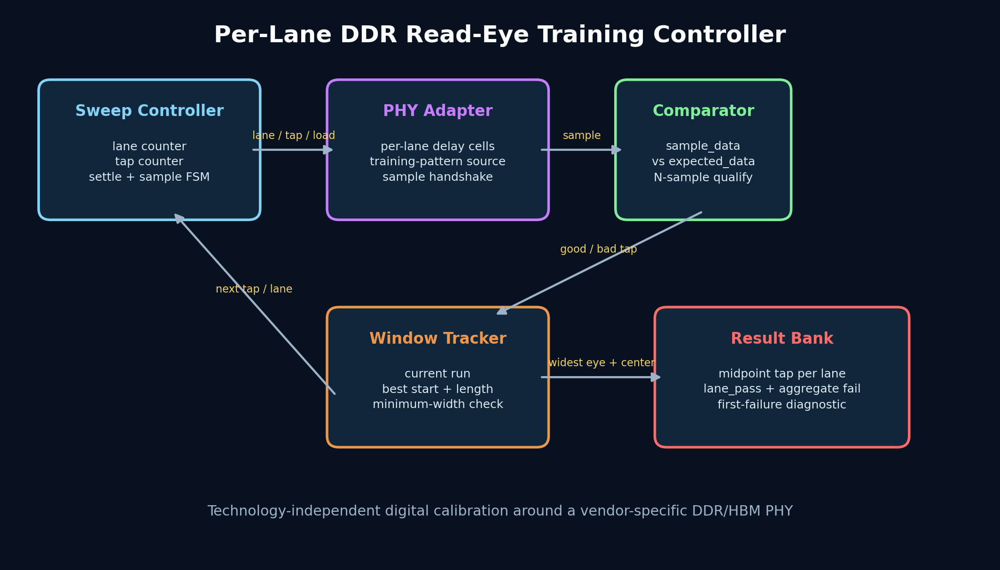
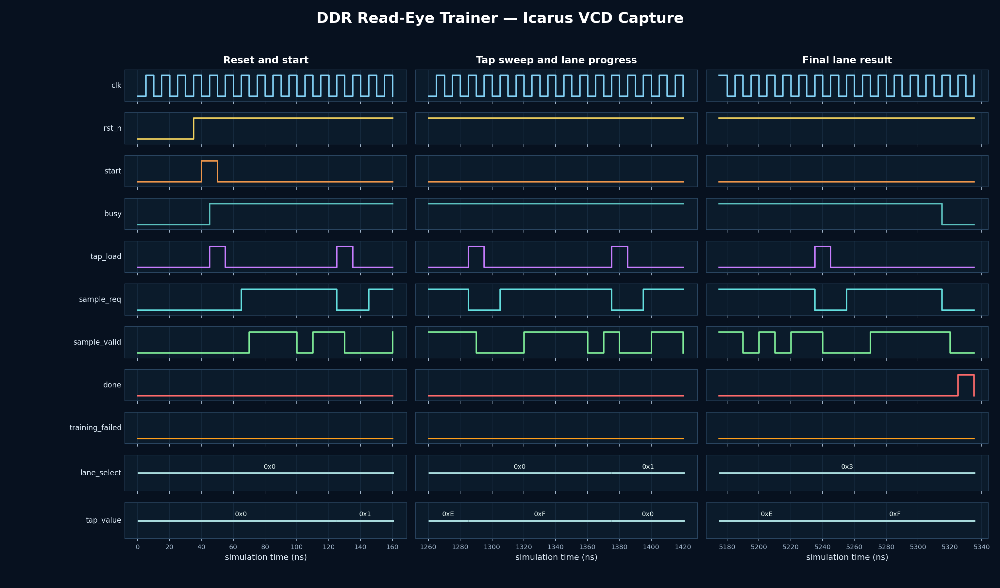

<!-- Author: Asresh Kuricheti -->
# Day 58: Per-Lane DDR Read-Eye Training Controller

## Overview

High-speed DDR and HBM receivers cannot assume that every data lane arrives at the same instant. Package length, voltage, temperature, and silicon variation move each lane's valid sampling window. This controller performs a startup calibration: it sweeps every delay tap on every lane, compares several received training bits with the expected pattern, finds the longest error-free window, and programs its midpoint.

The design is deliberately separated from the technology-specific delay cells and PHY. `tap_load`, `lane_select`, and `tap_value` drive the PHY; `sample_req` requests a comparison sample. This makes the controller reusable with FPGA IDELAY primitives, ASIC delay lines, or behavioral PHY models.

## Features

- Independent exhaustive delay sweep for every data lane
- Configurable number of lanes, taps, samples per tap, settling delay, and minimum eye width
- Longest-contiguous-window detection rejects isolated false-good taps
- Lower-middle midpoint selection gives deterministic behavior for even-width eyes
- Per-lane trained tap and pass/fail result
- Aggregate failure plus first-failing-lane diagnostic
- Backpressure-tolerant sample handshake and reset-safe outputs

## Parameters

| Parameter | Default | Meaning |
|---|---:|---|
| `LANES` | 4 | Number of independently trained receive lanes |
| `TAP_COUNT` | 32 | Delay settings swept per lane |
| `SAMPLES_PER_TAP` | 8 | Comparisons required before a tap is accepted |
| `SETTLE_CYCLES` | 2 | Quiet clocks after programming a new tap |
| `MIN_EYE_TAPS` | 4 | Minimum passing window width |
| `LANE_W` | derived | Encoded lane index width |
| `TAP_W` | derived | Delay-tap width |

## Ports

| Port | Direction | Description |
|---|---|---|
| `clk`, `rst_n` | input | Controller clock and asynchronous active-low reset |
| `start` | input | One-cycle command that starts a complete calibration |
| `busy`, `done` | output | Training-in-progress and one-cycle completion indication |
| `lane_select` | output | Lane currently connected to the checker |
| `tap_value`, `tap_load` | output | Delay setting and its programming strobe |
| `sample_req` | output | Requests another training-bit observation |
| `sample_valid` | input | Qualifies `sample_data` and `expected_data` |
| `sample_data` | input | Bit observed at the selected lane and tap |
| `expected_data` | input | Golden training-pattern bit for this observation |
| `trained_taps` | output | Packed per-lane midpoint tap settings |
| `lane_pass` | output | One bit per lane; high when the eye meets the minimum width |
| `training_failed` | output | High with `done` if any lane failed |
| `first_failed_lane` | output | Lowest lane encountered without a wide-enough eye |

## Architecture

```text
 start
   │
   ▼
┌─────────────────┐  lane/tap   ┌────────────────────┐
│ Sweep + settle  │─────────────▶│ PHY delay elements │
│ state machine   │              └─────────┬──────────┘
└────────┬────────┘                        │ sample
         │ request                         ▼
         │                     ┌──────────────────────┐
         └────────────────────▶│ Pattern comparator   │
                               └──────────┬───────────┘
                                          │ good/bad tap
                                          ▼
                               ┌──────────────────────┐
                               │ Longest-window scan  │
                               │ + midpoint selector  │
                               └──────────┬───────────┘
                                          ▼
                               trained taps + status
```



## How it works

1. A `start` pulse clears old results and selects lane zero, tap zero.
2. The controller asserts `tap_load`, waits `SETTLE_CYCLES`, then requests `SAMPLES_PER_TAP` observations. Backpressure simply stretches this phase.
3. Any mismatch marks that tap bad. Consecutive good taps extend the active eye candidate; a bad tap closes it.
4. The widest candidate is retained across the sweep. At the final tap, its lower-middle position becomes the trained setting if its width reaches `MIN_EYE_TAPS`.
5. The process repeats for every lane. `done` then pulses with the complete packed result and failure diagnostics.

Choosing the middle of the widest clean region maximizes timing margin on both sides. Requiring several comparisons per tap reduces the chance that a transient or a pattern-dependent transition is mistaken for a stable sampling point.

## Simulation timing



The waveform above is rendered from the VCD captured by the Icarus Verilog run. It shows reset release, tap stepping, sample handshakes, lane advancement, and final trained results from an actual simulation.

## Use cases

- DDR4/DDR5 controller initialization before normal memory traffic begins
- HBM pseudo-channel PHY calibration in AI accelerators and GPUs
- FPGA source-synchronous interfaces using programmable input-delay primitives
- Chiplet and die-to-die parallel-link deskew after power-up or temperature change
- Production test and post-silicon diagnostics that need lane-margin telemetry

In a complete memory subsystem, firmware starts this block after the DRAM has entered its training mode. A PHY adapter translates the generic tap interface into vendor-specific delay controls. Once every lane passes, firmware copies `trained_taps` into the live receive datapath; a failure can trigger retraining at a lower data rate or retire a bad lane/channel.

## Running the testbench

```bash
make icarus
# Alternatives: make verilator | make vcs | make questa
```

The testbench contains an independent behavioral PHY/channel model. It checks directed eyes at the tap-range edges, deliberately marginal lanes, eight randomized lane maps, randomized sample backpressure, the exact selected midpoint, pass/fail flags, first-failure reporting, and a global timeout. Success ends with `RESULT: *** PASS ***` and produces `ddr_read_eye_trainer.vcd`.
