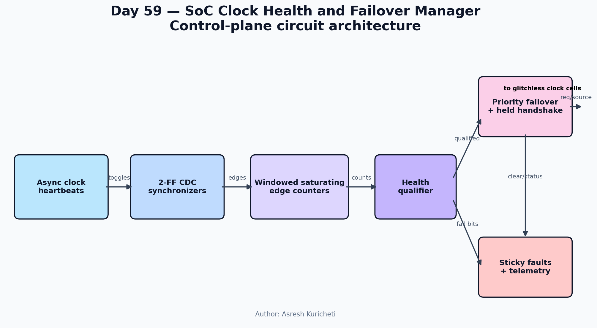
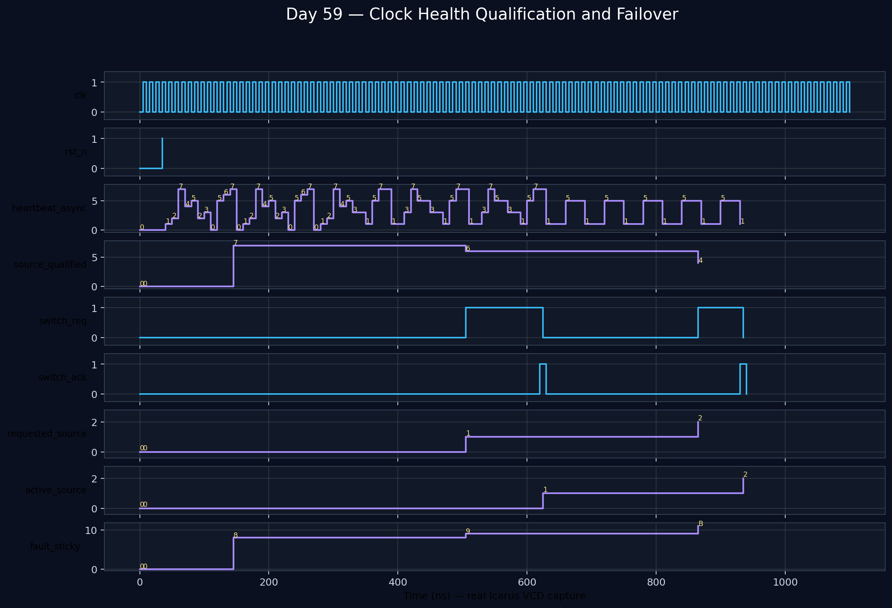

<!-- Author: Asresh Kuricheti -->
# Day 59 — SoC Clock Health and Failover Manager

## Overview
This control-plane block supervises multiple clock-source heartbeat toggles from a stable always-on domain. It measures activity, qualifies sources, records failures, and requests a handshake-controlled move to the highest-priority healthy backup. Technology-specific glitchless mux cells remain outside the block.

## Features
- Two-flop asynchronous-heartbeat synchronization
- Windowed saturating edge counters and programmable health thresholds
- Deterministic priority failover with a held request/acknowledge handshake
- Sticky per-source/all-sources-lost diagnostics and failover telemetry
- Parameterized, reset-safe, synthesizable SystemVerilog

## Parameters
| Parameter | Meaning |
|---|---|
| `SOURCES` | Number of monitored clocks |
| `WINDOW_CYCLES` | Always-on cycles per measurement window |
| `MIN_EDGES` | Minimum edges required for qualification |

## Ports
| Port | Direction | Purpose |
|---|---|---|
| `clk`, `rst_n` | input | Always-on clock and reset |
| `enable`, `clear_faults` | input | Monitoring and diagnostic controls |
| `heartbeat_async` | input | Toggle heartbeats from clock domains |
| `switch_ack` | input | External glitchless fabric completion |
| `active_source` | output | Current source index |
| `switch_req`, `requested_source` | output | Held failover command |
| `source_qualified` | output | Latest health result |
| `fault_sticky`, `no_source_fault` | output | Persistent diagnostics |
| `failover_count`, `edge_count_flat` | output | Operational telemetry |

## Architecture
```text
heartbeats -> [2-FF sync] -> [edge counters/window] -> [health qualifier]
                                                       |          |
                                                       v          v
                                                  [fault log] [priority + handshake] -> clock cells
```


## Simulation timing


This waveform is rendered from the real VCD captured by Icarus Verilog. It covers qualification, source-0 loss, a held switch request, acknowledgement, and source-1 takeover.

## How it works
Each heartbeat is a toggle, avoiding dependence on pulse width. Synchronized transitions increment per-source counters. At each window boundary the manager publishes health bits and clears the counters. If the active source is unhealthy, a priority encoder chooses a backup and holds `switch_req` until the external switch fabric acknowledges safe completion.

## Use cases
- Networking ASIC recovered-clock failover
- GPU/AI accelerator DVFS PLL supervision
- Automotive safety-SoC oscillator monitoring
- Chiplet recovered/local reference clock selection

## Run
```sh
make icarus    # or make verilator / make vcs / make questa
```

## Testbench coverage
The self-checking testbench exercises reset, multi-source qualification, two directed failovers, request/ack backpressure, total loss, sticky clearing, twelve randomized single-live-source recovery cases, timeout protection, VCD dumping, and a final `RESULT: *** PASS ***` verdict.
