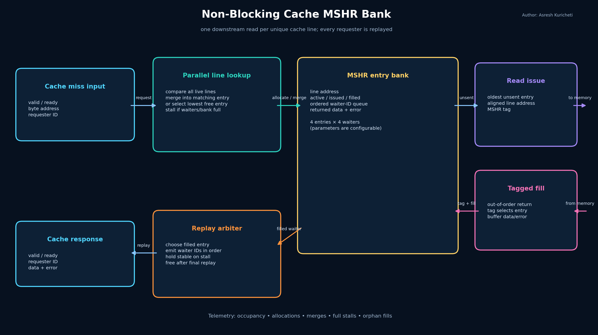
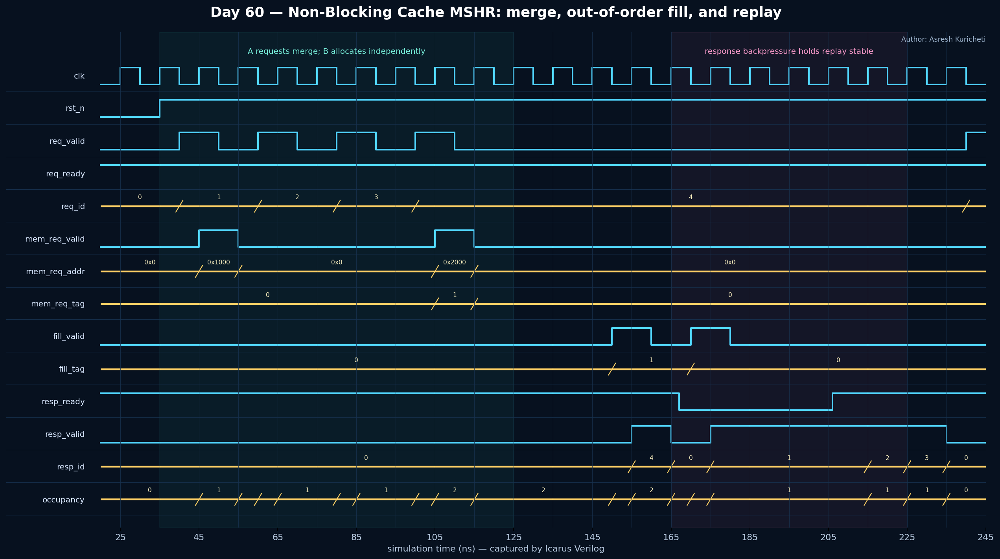

<!-- Author: Asresh Kuricheti -->
# Day 60 — Non-Blocking Cache MSHR Bank

## Overview

A miss-status holding register (MSHR) bank is the traffic-control center behind a non-blocking cache. Instead of freezing the processor on one cache miss, it remembers several missing cache lines at once, merges requests for the same line, and wakes every waiting transaction when memory returns the line. This implementation models the control and fill-buffer path used between a cache pipeline and an out-of-order memory fabric.

## Features

- Multiple independent cache misses may remain outstanding
- Secondary misses to the same cache line merge into one memory transaction
- Up to `WAITERS` transaction IDs are retained per line in arrival order
- Memory requests carry MSHR tags, so fills may return out of order
- Each returned line is buffered and replayed to all waiting clients
- Response backpressure is lossless and holds ID, data, and error stable
- Flush cancellation plus sticky full-stall and orphan-fill diagnostics
- Parameterized, reset-safe, synthesizable, lint-friendly SystemVerilog

## Parameters

| Parameter | Meaning |
|---|---|
| `ADDR_W` | Byte-address width |
| `DATA_W` | Width of the returned line or fill beat represented by this model |
| `ID_W` | Requester transaction-ID width |
| `LINE_BYTES` | Cache-line size; must be a power of two |
| `ENTRIES` | Number of simultaneously tracked unique line misses |
| `WAITERS` | Maximum merged requesters per line |

## Ports

| Port | Direction | Purpose |
|---|---|---|
| `clk`, `rst_n` | input | Clock and active-low asynchronous reset |
| `flush` | input | Cancels every live MSHR, such as after recovery or speculation squash |
| `req_valid`, `req_ready` | input/output | Cache-pipeline request handshake |
| `req_addr`, `req_id` | input | Miss address and transaction identifier |
| `mem_req_valid`, `mem_req_ready` | output/input | Downstream line-read handshake |
| `mem_req_addr`, `mem_req_tag` | output | Aligned line address and allocated MSHR tag |
| `fill_valid`, `fill_ready` | input/output | Returning-memory-fill handshake |
| `fill_tag`, `fill_data`, `fill_error` | input | MSHR tag, returned data, and error state |
| `resp_valid`, `resp_ready` | output/input | Replay response handshake |
| `resp_id`, `resp_data`, `resp_error` | output | Original requester ID and buffered result |
| `occupancy` | output | Number of active unique-line misses |
| `allocation_count`, `merge_count` | output | Lifetime allocation and secondary-miss telemetry |
| `full_stall_sticky` | output | Records a request that could not be accepted |
| `orphan_fill_sticky` | output | Records a fill with no issued live entry |

## Architecture

```text
 cache miss request
 addr + requester ID
          |
          v
 +-------------------+      unique line      +----------------------+
 | line match / free |---------------------->| memory request arbiter|----> memory
 | entry selection   |                       +----------------------+
 +---------+---------+                                  |
           | same line                                  | MSHR tag
           v                                            v
 +---------------------------------------------------------------+
 | MSHR entry bank                                               |
 | line address | issued | waiter-ID queue | fill data | error   |
 +---------------------------------------------------------------+
                                  ^                    |
                       out-of-order fill + tag         | replay
                                  |                    v
                              memory <---------- response arbiter ----> cache pipeline
```



The diagram separates the four important jobs: line matching, miss allocation, tagged memory issue/fill, and ordered waiter replay. It also shows why the MSHR tag must travel with the downstream read: memory is free to complete different cache lines in any order.

## Simulation timing



This timing image is rendered from the real VCD captured by Icarus Verilog. It shows reset release, three same-line requests merging behind one memory read, an independent second miss, the second fill returning first, replay backpressure, and the first fill waking all three merged requesters.

## How it works

On every accepted request, all active entries compare their stored cache-line address in parallel. A match appends the request ID to that entry's waiter queue and does not create another memory read. With no match, the lowest free entry is allocated. A separate arbiter presents each new entry to memory and marks it issued only after the downstream handshake.

The memory system returns the small MSHR tag with the data. That tag directly selects the entry, allowing fills to arrive in a different order from requests. The entry saves the data and error, then the response arbiter emits one response for each waiting ID. The entry is not freed until the final replay handshake, so downstream backpressure cannot overwrite a result.

`flush` invalidates all entries immediately. A later response for a canceled tag is refused and sets `orphan_fill_sticky`; a real system can use that telemetry to detect broken recovery coordination. Lifetime allocation and merge counters help architects estimate MSHR pressure and memory-level parallelism.

## Big-picture use cases

- CPU, GPU, and AI-accelerator L1/L2 caches that must overlap multiple DRAM misses
- Coherent interconnect home agents that merge requests for the same cache line
- Hardware page-table walkers that coalesce simultaneous translations
- DMA and storage front ends that deduplicate outstanding block reads
- Network-on-chip endpoints that track tagged, out-of-order responses
- Performance experiments for entry depth, merge depth, and backpressure behavior

## Running the simulation

```sh
make icarus
make verilator   # alternative simulator
make vcs         # Synopsys VCS
make questa      # Siemens Questa
```

Each target compiles the design and the same self-checking testbench. `make clean` removes generated simulator output.

## What the testbench checks

The golden scoreboard gives every requester ID its independently calculated line data and error result. Directed tests cover same-line merging, out-of-order fills, stable replay under backpressure, error fanout, full-bank stalling, entry reuse, flush cancellation, and orphan-fill detection. Eight randomized batches vary one to four waiters on each of four lines, shuffle fill order, and randomly throttle the response port. A watchdog prevents hangs, a VCD is dumped, and success prints `RESULT: *** PASS ***`.
