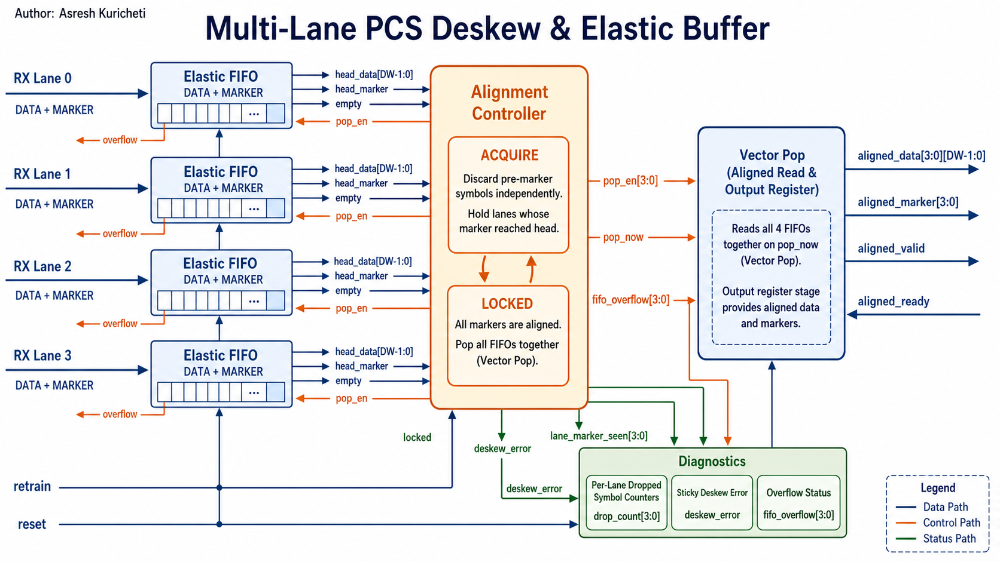
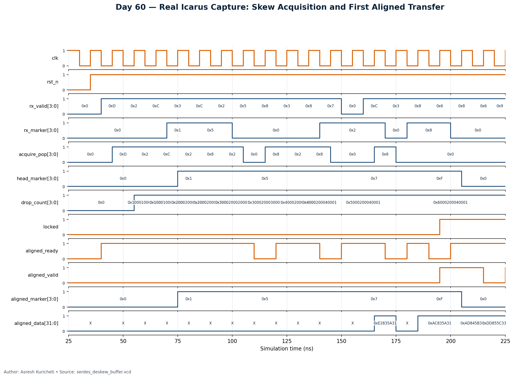

<!-- Author: Asresh Kuricheti -->
# Day 60: Multi-Lane SerDes PCS Deskew and Elastic Buffer

High-speed links split a wide word across several serial lanes. Package, board,
and receiver delays make those lanes arrive at different times, so the receiver
must not forward them as one word until a common alignment marker reaches every
lane. This project implements that receive-side Physical Coding Sublayer (PCS)
function as clean, synthesizable SystemVerilog.



*Figure 1 — Four independent receive lanes feed elastic FIFOs. The alignment
controller discards only pre-marker symbols, holds lanes already at a marker,
then changes to lockstep vector reads.*

## Overview

Each lane has an independent data-plus-marker FIFO. During acquisition, the
controller advances a lane until its marker reaches that FIFO's head; that lane
then waits while the others catch up. Once all head entries are markers,
`locked` asserts and every accepted output transaction pops all lane FIFOs
together. This preserves symbol position even when lane inputs pause
independently or the consumer applies backpressure.

The controller continuously checks alignment. A partial marker vector while
locked is treated as loss of alignment: output is suppressed, the sticky
`deskew_error` flag is set, and the machine returns to acquisition without
mixing lane epochs. A `retrain` request flushes buffered data and starts a clean
search while retaining sticky diagnostics for post-silicon debug.

## Features

- Parameterized lane count, symbol width, FIFO depth, and diagnostic width.
- Per-lane elastic storage with simultaneous push/pop at full occupancy.
- Marker-based acquisition with independent pre-marker discard.
- Backpressure-safe ready/valid output and lockstep vector reads.
- Automatic loss-of-alignment detection and reacquisition.
- Sticky per-lane overflow and aggregate deskew-error reporting.
- Saturating per-lane discarded-symbol counters for skew telemetry.
- Asynchronous active-low reset and synchronous retraining.
- No generated clocks, latches, unsized datapath state, or non-synthesizable RTL.

## Parameters

| Parameter | Default | Meaning |
|---|---:|---|
| `LANES` | 4 | Number of independently arriving serial lanes; must be at least 2. |
| `DATA_WIDTH` | 8 | Decoded PCS symbol width per lane. |
| `FIFO_DEPTH` | 8 | Entries in each lane's elastic FIFO; must be at least 2. |
| `DROP_COUNT_WIDTH` | 16 | Width of each saturating acquisition-discard counter. |

## Ports

| Port | Direction | Width | Meaning |
|---|---|---:|---|
| `clk` | input | 1 | PCS receive clock. |
| `rst_n` | input | 1 | Asynchronous active-low reset. |
| `retrain` | input | 1 | Flush all FIFOs and return to acquisition. |
| `rx_valid` | input | `LANES` | Per-lane input-valid bits. |
| `rx_ready` | output | `LANES` | Per-lane space/acceptance indication. |
| `rx_data` | input | `LANES × DATA_WIDTH` | Decoded symbol on every receive lane. |
| `rx_marker` | input | `LANES` | Marks a lane-alignment symbol. |
| `aligned_valid` | output | 1 | A complete aligned lane vector is available. |
| `aligned_ready` | input | 1 | Downstream accepts the aligned vector. |
| `aligned_data` | output | `LANES × DATA_WIDTH` | Deskewed output symbols. |
| `aligned_marker` | output | `LANES` | Marker bits corresponding to the output vector. |
| `locked` | output | 1 | All lanes are aligned and in lockstep mode. |
| `deskew_error` | output | 1 | Sticky overflow or marker-mismatch diagnostic. |
| `fifo_overflow` | output | `LANES` | Sticky overflow bit for each lane. |
| `drop_count` | output | `LANES × DROP_COUNT_WIDTH` | Saturating pre-marker discard count per lane. |

## Block diagram

```text
 rx lane 0 ──> [data+marker FIFO] ──head──┐
 rx lane 1 ──> [data+marker FIFO] ──head──┤
 rx lane 2 ──> [data+marker FIFO] ──head──┼──> [alignment controller]
 rx lane 3 ──> [data+marker FIFO] ──head──┘       │ acquire: lane pops
                                                  │ locked: vector pop
                                                  v
 aligned_ready <── ready/valid ── [lockstep aligned_data + aligned_marker]
                                                  │
                    [drop counts | overflow | sticky deskew error]
```

## How it works

1. **Buffer independently.** Each `rx_valid && rx_ready` event stores one
   symbol and its marker bit in that lane's circular FIFO. A lane may pause
   without stalling the other lane inputs.
2. **Acquire a common boundary.** An unmarked FIFO head is discarded. A marked
   head is held. This naturally removes the different amounts of leading skew
   without requiring a barrel shifter or a large combinational memory scan.
3. **Enter lock.** When every non-empty head is a marker, `locked` asserts. The
   marker vector remains stable until the consumer accepts it.
4. **Read in lockstep.** Thereafter, all lane FIFOs pop only on
   `aligned_valid && aligned_ready`, so corresponding symbol indices remain in
   the same output word under arbitrary downstream backpressure.
5. **Protect alignment.** If some, but not all, FIFO heads contain a marker,
   `aligned_valid` is suppressed before bad data can escape. The error is
   recorded and acquisition restarts from the current heads.

## Simulation timing



*Figure 2 — Real Icarus Verilog VCD capture. Reset releases, independently
skewed lane markers accumulate at the FIFO heads, `acquire_pop` drops leading
symbols, all four marker bits become `0xF`, `locked` asserts, and the first
aligned marker vector transfers when ready.*

## Running the simulation

```bash
make icarus
make verilator
make vcs
make questa
make clean
```

The supplied run was executed with Icarus Verilog. It completed 64 aligned
symbols and 821 checks before printing:

```text
RESULT: *** PASS ***
```

## What the testbench checks

The self-checking testbench uses a separate symbol-index model rather than
reusing DUT state. It combines a directed skew pattern of 1, 4, 2, and 6
leading symbols with randomized per-lane valid gaps and randomized downstream
backpressure. On every transfer it checks all lane values and the complete
marker vector against the golden sequence. It also checks lock/valid protocol,
per-lane discard totals, overflow/error invariants, minimum verification depth,
and a hard timeout. A VCD is always dumped for debug and waveform rendering.

## Where this block is used

- **PCI Express and CXL PHY/PCS receive paths:** lane alignment before link-layer
  packet reconstruction on x4, x8, or x16 links.
- **Ethernet and InfiniBand gearboxes:** deskewing bonded lanes after block-lock
  and alignment-marker detection.
- **NVLink-style accelerator fabrics:** rebuilding wide flits after independent
  high-speed lane transport.
- **Chiplet and die-to-die links:** absorbing lane-to-lane package and PHY
  latency variation before protocol processing.
- **Optical module and backplane receivers:** compensating fixed skew and short
  elastic-rate disturbances while preserving ready/valid flow control.

## Design trade-offs

The architecture spends `LANES × FIFO_DEPTH × (DATA_WIDTH + 1)` storage bits to
keep the alignment control local and timing-friendly. FIFO depth must exceed the
worst expected lane skew plus any input-rate disturbance. This teaching model
assumes markers have already been recognized by a decoder and that all lanes
share the presented PCS clock; a production multi-clock PHY would place CDC-safe
elastic buffers before this logic and would usually add programmable marker
rules, hysteresis, and link-management handshakes.

## Author

Asresh Kuricheti
