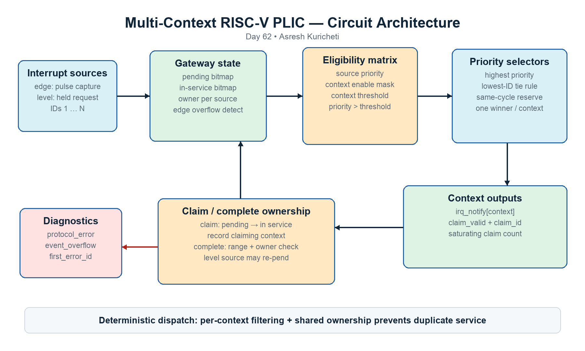
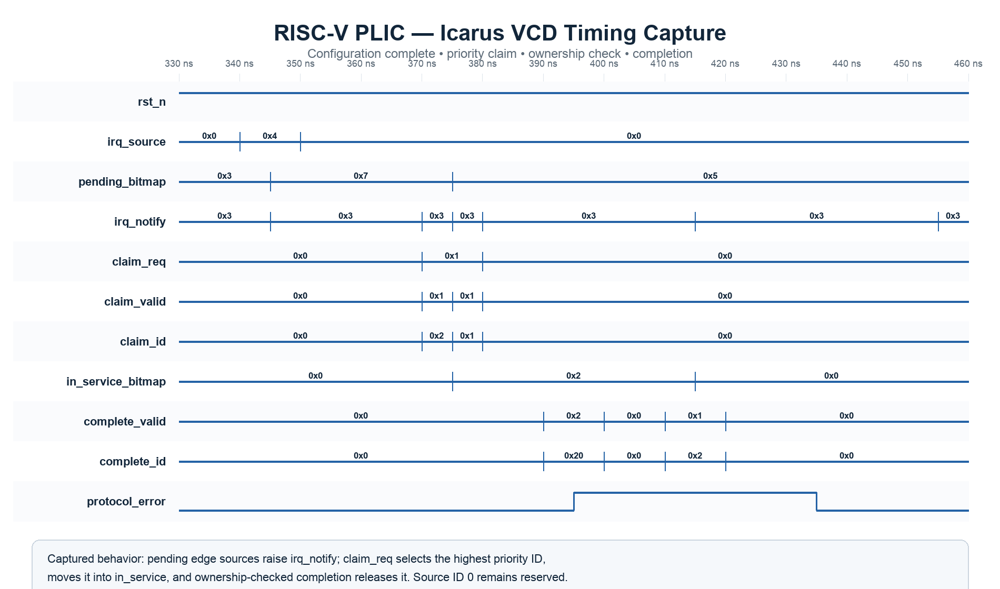

<!-- Author: Asresh Kuricheti -->
# Day 62: Multi-Context RISC-V PLIC Interrupt Controller

A processor cannot poll every peripheral continuously. This project implements
the hardware dispatch point that collects asynchronous peripheral requests,
prioritizes them, and tells each CPU or privilege context which interrupt to
service next. Its behavior follows the central ideas of the RISC-V Platform-Level
Interrupt Controller (PLIC) while exposing compact direct configuration ports so
the arbitration and gateway logic remain easy to study and reuse.



*Figure 1 — Edge/level gateways feed shared pending and in-service state. Each
context applies its enable mask and threshold before the priority selector;
claim/complete transactions atomically transfer ownership.*

## Overview

Every physical source has a programmable nonzero priority. Each execution
context—typically a CPU hart, supervisor context, or safety processor—has its own
enable bitmap and priority threshold. A context receives `irq_notify` whenever
at least one eligible source is pending. When software issues a claim, the
controller returns and atomically reserves the highest-priority source. Equal
priorities use the lowest source ID, giving deterministic hardware behavior.

Multiple contexts may claim in the same cycle. Context zero has deterministic
first choice, and a reservation mask forces later contexts to select a different
source. Completion is accepted only from the context that owns the interrupt.
Invalid or wrong-context completions are rejected and recorded for firmware or
post-silicon debug.

## Features

- Parameterized source count, context count, priority width, and counters.
- Per-source elaboration-time edge/level gateway selection with `EDGE_MASK`.
- One-deep coalescing edge capture and level-sensitive re-pending.
- Independent per-context enable masks and programmable thresholds.
- Highest-priority selection with deterministic lowest-ID tie breaking.
- Atomic same-cycle multi-context claim with duplicate prevention.
- Ownership-checked completion and held-off service until completion.
- Sticky malformed-completion and edge-overflow diagnostics.
- First-error source ID plus saturating per-context claim telemetry.
- Asynchronous active-low reset and synchronous diagnostic clear.
- Synthesizable, latch-free, generated-clock-free SystemVerilog.

## Parameters

| Parameter | Default | Meaning |
|---|---:|---|
| `SOURCES` | 8 | Number of interrupt sources; external IDs are 1 through `SOURCES`. |
| `CONTEXTS` | 2 | Independently enabled and thresholded CPU/privilege contexts. |
| `PRIORITY_WIDTH` | 3 | Width of every source priority and context threshold. |
| `EDGE_MASK` | 0 | Bit `n=1` selects rising-edge capture for source `n`; zero selects level. |
| `COUNT_WIDTH` | 16 | Width of each saturating successful-claim counter. |
| `ID_WIDTH` | derived | Width needed for source IDs including reserved ID zero. |
| `CTX_WIDTH` | derived | Width needed for a context selector. |

## Ports

| Port | Direction | Width | Meaning |
|---|---|---:|---|
| `clk` | input | 1 | Controller clock. |
| `rst_n` | input | 1 | Asynchronous active-low reset. |
| `clear_status` | input | 1 | Clears sticky diagnostics and claim counters, not live interrupts. |
| `irq_source` | input | `SOURCES` | Raw edge- or level-sensitive peripheral requests. |
| `priority_we/id/value` | input | mixed | Writes one source's priority; ID zero is reserved. |
| `enable_we/context/value` | input | mixed | Replaces one context's source-enable bitmap. |
| `threshold_we/context/value` | input | mixed | Writes one context's minimum accepted priority. |
| `claim_req` | input | `CONTEXTS` | Per-context combinational claim request. |
| `claim_valid` | output | `CONTEXTS` | A nonzero source ID is available for the request. |
| `claim_id` | output | `CONTEXTS × ID_WIDTH` | Winning source ID; zero means no eligible interrupt. |
| `complete_valid/id` | input | mixed | Context returns a claimed source after service. |
| `irq_notify` | output | `CONTEXTS` | At least one enabled source exceeds the threshold. |
| `pending_bitmap` | output | `SOURCES` | Captured but unclaimed requests. |
| `in_service_bitmap` | output | `SOURCES` | Claimed requests awaiting valid completion. |
| `protocol_error` | output | 1 | Sticky invalid write or completion diagnostic. |
| `event_overflow` | output | 1 | Sticky second edge while the one-entry gateway is already pending. |
| `first_error_id` | output | `ID_WIDTH` | First malformed transaction's source ID. |
| `claim_count` | output | `CONTEXTS × COUNT_WIDTH` | Saturating successful-claim telemetry. |

## ASCII block diagram

```text
 interrupt sources
 edge 1..E ──> [rising-edge capture] ──┐
 level E+1..N -> [level gateway] ──────┼──> [pending | in-service | owner]
                                      │                  │
 priority RAM ────────────────────────┤                  │
                                      v                  v
 context 0: [enable & threshold] -> [priority/tie selector] -> claim 0
 context 1: [enable & threshold] -> [priority/tie selector] -> claim 1
                                      ^                  │
                              same-cycle reservation <───┘

 completion(context, ID) -> [range + owner check] -> release / level re-pend
                                     └────────────-> sticky diagnostics
```

## How it works

1. **Capture requests.** A rising edge sets its source pending bit. A level
   request remains pending whenever asserted and not already in service.
2. **Filter per context.** Eligibility requires pending state, no current owner,
   an enabled source bit, nonzero priority, and priority above the context's
   threshold.
3. **Select deterministically.** Each context scans all eligible sources and
   chooses the highest priority. Scanning low IDs first and replacing only on a
   strictly higher priority implements the PLIC lowest-ID tie rule.
4. **Claim atomically.** On the clock edge, a granted source moves from pending
   to in-service and records the claiming context. A temporary reservation mask
   prevents two simultaneous contexts from receiving the same ID.
5. **Complete safely.** Only the recorded owner can complete a live source. An
   asserted level source immediately re-pends after valid completion, while an
   edge source waits for another rising edge.

## Simulation timing



*Figure 2 — Real Icarus VCD capture. Edge sources become pending, both contexts
observe notifications, context 0 claims the highest-priority ID, ownership moves
to the in-service bitmap, and a checked completion releases the source.*

## Practical use cases

- **Linux-capable RISC-V SoCs:** prioritize UART, storage, Ethernet, and DMA
  events across machine- and supervisor-mode contexts.
- **Multi-core accelerators:** route shared completion queues and fault sources
  to control processors without polling every engine.
- **Automotive controllers:** give safety faults higher priority than routine
  telemetry and reject completion from the wrong lockstep core.
- **FPGA control planes:** combine many soft-IP interrupts behind a small,
  firmware-friendly dispatch interface.
- **Storage and networking ASICs:** expose queue, link, thermal, and ECC events
  with deterministic arbitration and useful service counters.

## Running the simulation

```bash
make icarus
make verilator
make vcs
make questa
make clean
```

The testbench always creates `riscv_plic.vcd`. The committed waveform was
rendered from a real Icarus simulation capture. The reference run completed 772
checks and 20 claimed interrupts before printing:

```text
RESULT: *** PASS ***
```

## What the testbench checks

The self-checking testbench maintains independent golden priority, enable,
threshold, pending, ownership, and service state. Directed tests cover reset,
configuration, threshold filtering, priority and ID tie breaking, simultaneous
two-context claims, wrong-context completion rejection, sticky-status clearing,
level re-pending, edge coalescing, and overflow reporting. An 80-operation
random phase mixes edge pulses, level changes, claims, completions, and
backpressure-free idle cycles. Every operation compares notifications, pending
and in-service bitmaps, source IDs, and claim counters; a hard timeout prevents a
hung regression. Success ends with `RESULT: *** PASS ***`.

## Design notes

This project focuses on the PLIC core rather than a particular bus wrapper. A
production SoC can map the three configuration write channels and claim/complete
ports into AXI4-Lite, APB, TileLink, or CSR space. Raw asynchronous interrupt
pins normally pass through technology-specific synchronizers before this block.
The one-entry edge gateway deliberately coalesces duplicates and reports an
overflow; lossless bursty sources should instead present a level until serviced
or use a counter/FIFO gateway.

## Author

Asresh Kuricheti
