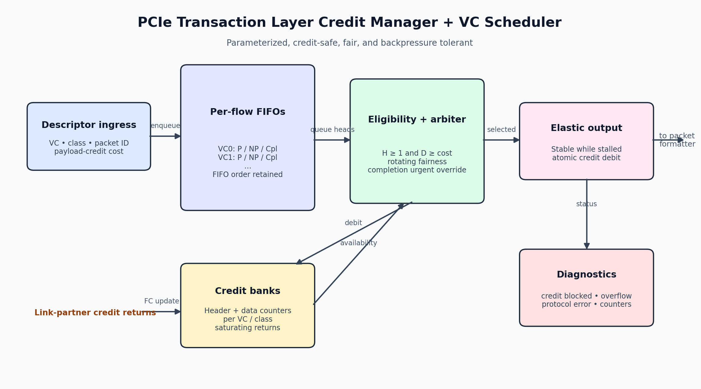
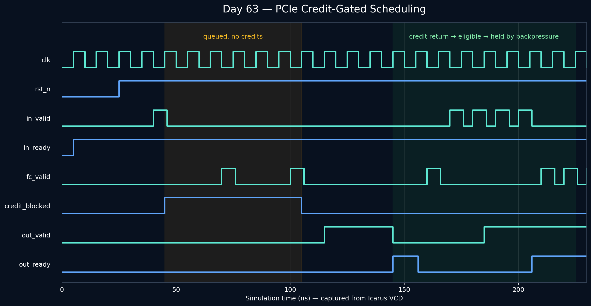

<!-- Author: Asresh Kuricheti -->
# Day 63: PCIe Transaction Layer Credit Manager and VC Scheduler

**Author: Asresh Kuricheti**

## Overview

PCIe transmitters may only launch a Transaction Layer Packet (TLP) when the
receiver has advertised enough header and payload buffer credits. This project
implements that bookkeeping together with a fair scheduler across multiple
Virtual Channels (VCs) and the three PCIe traffic classes: Posted (P),
Non-Posted (NP), and Completion (Cpl).

The block is intentionally packet-descriptor oriented: upstream logic supplies
an opaque packet ID and its payload-credit cost; downstream packet storage uses
the ID to retrieve the full TLP. This keeps the example focused on flow control,
arbitration, deadlock avoidance, and backpressure.

## Features

- Independent header and data-credit pools for every VC and traffic class
- Saturating credit returns, with credits debited only when a descriptor leaves a queue
- Per-VC/class FIFOs with ordering preserved inside each PCIe flow-control domain
- Rotating arbitration across all eligible queues to prevent starvation
- Completion-urgent override when a completion queue approaches full
- One-entry elastic output that remains stable under downstream backpressure
- Sticky malformed-request and queue-overflow diagnostics
- Saturating accepted/transmitted telemetry counters
- Parameterized VC count, FIFO depth, descriptor ID, credit, and counter widths

## Parameters

| Parameter | Default | Meaning |
|---|---:|---|
| `VCS` | 2 | Number of independent PCIe-style Virtual Channels |
| `DEPTH` | 4 | Descriptor entries per VC/class queue |
| `ID_WIDTH` | 12 | Width of the opaque packet descriptor ID |
| `CREDIT_WIDTH` | 8 | Width of each advertised credit counter |
| `DATA_WIDTH` | 8 | Width of a packet's payload-credit requirement |
| `COUNT_WIDTH` | 16 | Width of saturating activity counters |

## Ports

| Port | Direction | Description |
|---|---|---|
| `clk`, `rst_n` | Input | Clock and asynchronous active-low reset |
| `clear_status` | Input | Clears sticky diagnostics and telemetry |
| `in_valid`, `in_ready` | Input, Output | Upstream descriptor handshake |
| `in_vc`, `in_class` | Input | VC and P/NP/Cpl class (`0/1/2`) |
| `in_id` | Input | Opaque descriptor identifier |
| `in_data_credits` | Input | Payload credits required by this packet |
| `fc_valid` | Input | Credit-return update strobe |
| `fc_vc`, `fc_class` | Input | Credit pool selected for update |
| `fc_header_inc`, `fc_data_inc` | Input | Saturating header/data credit increments |
| `out_valid`, `out_ready` | Output, Input | Scheduled descriptor handshake |
| `out_vc`, `out_class`, `out_id` | Output | Metadata for the selected packet |
| `out_data_credits` | Output | Payload credits debited for the selected packet |
| `completion_urgent` | Output | A completion queue is one slot from full |
| `credit_blocked` | Output | At least one queued head lacks credits |
| `protocol_error` | Output | Sticky invalid VC/class diagnostic |
| `queue_overflow` | Output | Sticky attempted enqueue to a full queue |
| `accepted_count`, `transmitted_count` | Output | Saturating traffic telemetry |

## Block diagram



```text
 Descriptor input
       |
       v
 +-------------------+       +---------------------------+
 | VC x {P,NP,Cpl}   | heads | Eligibility: H>0 && D>=N |
 | descriptor FIFOs  +------>+ credit-aware arbitration  |
 +-------------------+       | + completion urgent rule  |
       ^                       +-------------+-------------+
       | credit debit                        |
 +-----+--------------+                      v
 | Per-flow H/D credit|              +---------------+
 | counters + returns |              | Elastic output|--> TLP store/formatter
 +--------------------+              +---------------+
```

## Simulation timing

The waveform below is rendered from the VCD produced by the passing Icarus
simulation. It highlights reset release, a descriptor blocked by insufficient
credits, credit return, output backpressure, and eventual transmission.



## How it works

Each accepted descriptor enters one of `VCS × 3` FIFOs. The head descriptor is
eligible only when its flow-control domain owns at least one header credit and
enough data credits for the complete payload. A rotating pointer selects among
eligible heads. When completion occupancy reaches `DEPTH-1`, completion traffic
temporarily receives priority; this models an important practical rule because
blocking completions can prevent non-posted reads from making forward progress.

The selected descriptor moves into an elastic output register and its credits
are atomically debited. If `out_ready` falls, every output field stays stable.
Credit updates use saturating arithmetic, preventing wraparound when a link
partner returns a large accumulated credit count.

## Practical use cases

- PCIe or CXL endpoint transmit paths that share a physical link across traffic classes
- FPGA PCIe accelerators that must avoid overrunning hard-IP receive buffers
- DMA engines whose reads, writes, and completions need independent flow control
- Chiplet fabrics that use PCIe-like header/payload credits and virtual channels
- Verification models for studying throughput loss caused by credit starvation

## Running

```bash
make icarus
make verilator
make vcs
make questa
make clean
```

Successful simulation ends with `RESULT: *** PASS ***` and writes
`pcie_credit_scheduler.vcd`.

## What the testbench checks

The self-checking testbench maintains an independent descriptor scoreboard. It
first runs directed reset, zero-credit, partial-credit, backpressure, and
completion-urgency scenarios. It then mixes randomized packet arrivals, credit
returns, traffic classes, virtual channels, payload costs, and downstream
stalls. Every transmitted descriptor is checked for prior acceptance, no
duplication, intact metadata, and FIFO ordering within its VC/class domain. A
watchdog terminates stalled simulations.
